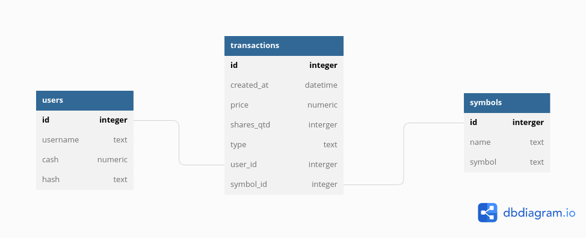

# Finance

O Finance é um aplicativo web escrito em Python que permite aos usuários gerenciarem suas "carteiras" de ações, realizando operações de compra, venda e consulta de preços por meio da API iex. Desenvolvido durante o curso CS50 da Fundação Estudar, o objetivo desse projeto foi aplicar na prática todos os conceitos apresentados.





## Desenvolvimento 


### Crie e ative um ambiente isolado com `virtualenv`: 

```bash
$ python -m venv .venv
$ source .venv
```


### Instale dependências 

```bash
$ make install
```

ou

```bash
$ pip install -e '.[dev]'
```


### Gere uma SECRET_KEY

```
$ python -c 'import secrets; print(secrets.token_hex())'
```


### Obtenha credenciais de acesso a [api iex](https://cloud.iexapi.com) 

- Visite [https://iexcloud.io/cloud-login#/register/](https://iexcloud.io/cloud-login#/register/).
- Selecione o tipo de conta “Individual”, digite seu endereço de e-mail e uma senha e clique em "Create account”.
- Depois de registrado, role para baixo até “Get started for free” e clique em “Select Start” para escolher o plano gratuito.
- Depois de confirmar sua conta por e-mail de confirmação, visite [https://iexcloud.io/console/tokens](https://iexcloud.io/console/tokens).
- Copie a chave que aparece na coluna Token, deve começar com `pk_`.


### Crie as variáveis de ambiente

Crie o arquivo `.env` com o seguinte conteúdo

```
# .env
API_KEY=your_api_key
SECRET_KEY=your_secret_key
FLASK_APP=finance.application
FLASK_ENV=development
DATABASE="sqlite:///finance.db"
```


### Execute

```bash
$ flask db-init
$ flask run
```


### Acesse

http://localhost:5000/


[iexcloud api documentation](https://iexcloud.io/docs/api/)
[ticker symbols](https://iextrading.com/trading/eligible-symbols/)
[how to find symbols (api)](https://iexcloud.zendesk.com/hc/en-us/articles/1500012389322-How-to-Find-All-Supported-Symbols-on-IEX-Cloud)
